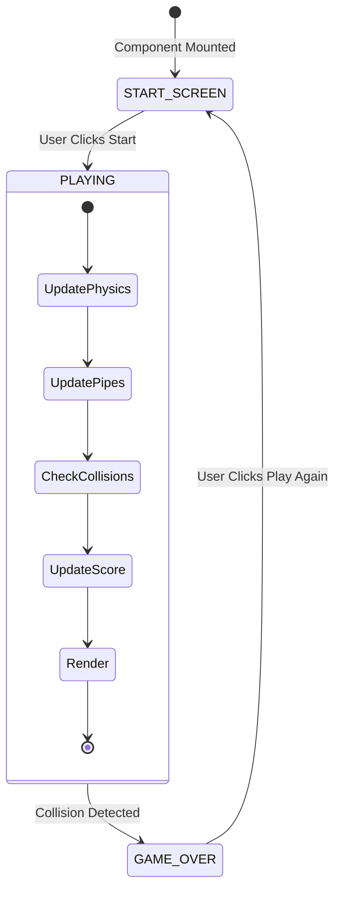
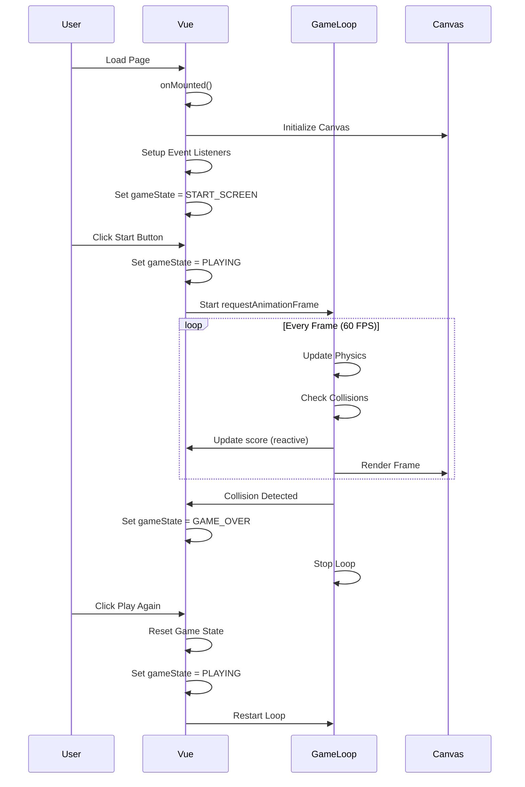
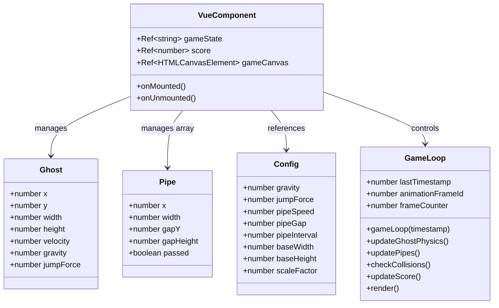

# Design Document: Flappy Kiro Game

## Overview

Flappy Kiro is a browser-based 2D endless scroller game built with Vue.js 3 Composition API and HTML5 Canvas. The architecture prioritizes performance by maintaining a clear separation between Vue's reactive state (for UI updates) and non-reactive game state (for high-frequency physics calculations). The game loop runs at 60 FPS using `requestAnimationFrame`, with all game entities rendered on Canvas for optimal performance.

### Key Design Principles

1. **Performance-First Architecture**: Game entities and physics calculations exist outside Vue's reactivity system to avoid unnecessary overhead during the 60 FPS game loop
2. **Separation of Concerns**: Clear boundaries between reactive UI state, non-reactive game logic, and rendering
3. **Responsive Design**: Canvas dimensions and game parameters adapt to viewport size for cross-platform compatibility
4. **Extensibility**: Placeholder rendering with clear integration points for future sprite and audio assets

## Architecture

### Component Structure

The application consists of a single Vue 3 Single File Component (SFC) using the Composition API with `<script setup>` syntax. This component manages:

- **Reactive State**: Game state enum (START_SCREEN, PLAYING, GAME_OVER), score, and UI visibility flags
- **Non-Reactive State**: Game entities (ghost, pipes), physics parameters, and configuration
- **Canvas Rendering**: Direct Canvas 2D context manipulation for all visual elements
- **Event Handling**: Keyboard and mouse input processing
- **Game Loop**: `requestAnimationFrame`-based update and render cycle

### State Management Architecture

```
┌─────────────────────────────────────────────────────────┐
│                    Vue Component                         │
│  ┌────────────────────────────────────────────────┐    │
│  │         Reactive State (Vue refs)              │    │
│  │  - gameState: Ref<'START' | 'PLAYING' | 'OVER'>│    │
│  │  - score: Ref<number>                          │    │
│  └────────────────────────────────────────────────┘    │
│                         │                               │
│                         │ Updates UI                    │
│                         ▼                               │
│  ┌────────────────────────────────────────────────┐    │
│  │         Non-Reactive Game State                │    │
│  │  - ghost: { x, y, velocity, width, height }    │    │
│  │  - pipes: Array<{ x, gapY, width, gapHeight }> │    │
│  │  - config: { gravity, jumpForce, pipeSpeed }   │    │
│  └────────────────────────────────────────────────┘    │
│                         │                               │
│                         │ Read/Write at 60 FPS          │
│                         ▼                               │
│  ┌────────────────────────────────────────────────┐    │
│  │            Game Loop (RAF)                     │    │
│  │  1. Update physics                             │    │
│  │  2. Check collisions                           │    │
│  │  3. Update score                               │    │
│  │  4. Render to Canvas                           │    │
│  └────────────────────────────────────────────────┘    │
└─────────────────────────────────────────────────────────┘
```

### Data Flow

1. **User Input** → Event handlers → Modify non-reactive game state (ghost velocity)
2. **Game Loop** → Update non-reactive state → Check conditions → Update reactive state (score, gameState)
3. **Reactive State Changes** → Vue reactivity → UI overlay updates
4. **Game Loop** → Canvas rendering (independent of Vue reactivity)

## Components and Interfaces

### Vue Component Structure

```vue
<script setup>
// Reactive state for UI
const gameState = ref('START_SCREEN')
const score = ref(0)
const gameCanvas = ref(null)

// Non-reactive game state
let ghost = { x, y, velocity, width, height, gravity }
let pipes = []
let config = { gravity, jumpForce, pipeSpeed, pipeGap, pipeInterval }
let animationFrameId = null

// Lifecycle
onMounted(() => {
  initializeCanvas()
  setupEventListeners()
  handleResize()
})

// Game loop functions
function gameLoop(timestamp) { ... }
function updatePhysics() { ... }
function checkCollisions() { ... }
function render() { ... }

// Input handlers
function handleJump() { ... }
function handleStart() { ... }
</script>

<template>
  <div class="game-container">
    <canvas ref="gameCanvas"></canvas>
    
    <!-- UI Overlays -->
    <div v-if="gameState === 'START_SCREEN'" class="overlay start-screen">
      <button @click="handleStart">Start Game</button>
    </div>
    
    <div v-if="gameState === 'PLAYING'" class="overlay score-display">
      Score: {{ score }}
    </div>
    
    <div v-if="gameState === 'GAME_OVER'" class="overlay game-over">
      <h2>Game Over</h2>
      <p>Final Score: {{ score }}</p>
      <button @click="handleStart">Play Again</button>
    </div>
  </div>
</template>
```

### Game Entities

#### Ghost Entity

```javascript
const ghost = {
  x: 100,              // Fixed horizontal position
  y: 0,                // Vertical position (updated each frame)
  width: 40,           // Collision box width
  height: 40,          // Collision box height
  velocity: 0,         // Current vertical velocity
  gravity: 0.5,        // Downward acceleration per frame
  jumpForce: -10       // Upward velocity applied on jump
}
```

#### Pipe Entity

```javascript
const pipe = {
  x: 800,              // Horizontal position (moves left)
  width: 60,           // Pipe width
  gapY: 250,           // Y position of gap center
  gapHeight: 150,      // Height of passable gap
  passed: false        // Flag for score tracking
}
```

### Configuration Object

```javascript
const config = {
  // Physics
  gravity: 0.5,
  jumpForce: -10,
  
  // Pipe generation
  pipeSpeed: 3,
  pipeGap: 150,
  pipeInterval: 120,   // Frames between pipe spawns
  
  // Responsive scaling
  baseWidth: 800,
  baseHeight: 600,
  scaleFactor: 1
}
```

### Canvas Interface

The Canvas 2D rendering context provides the drawing interface:

```javascript
const ctx = canvas.getContext('2d')

// Rendering methods used:
ctx.clearRect(x, y, width, height)
ctx.fillStyle = color
ctx.fillRect(x, y, width, height)
// Future: ctx.drawImage(image, x, y, width, height)
```

## Data Models

### Game State Enum

```javascript
const GameState = {
  START_SCREEN: 'START_SCREEN',
  PLAYING: 'PLAYING',
  GAME_OVER: 'GAME_OVER'
}
```

### Collision Detection Model

AABB (Axis-Aligned Bounding Box) collision detection uses rectangular bounds:

```javascript
function checkAABBCollision(rect1, rect2) {
  return rect1.x < rect2.x + rect2.width &&
         rect1.x + rect1.width > rect2.x &&
         rect1.y < rect2.y + rect2.height &&
         rect1.y + rect1.height > rect2.y
}
```

### Responsive Scaling Model

```javascript
const responsiveConfig = {
  viewport: {
    width: window.innerWidth,
    height: window.innerHeight,
    aspectRatio: width / height,
    orientation: width >= height ? 'landscape' : 'portrait'
  },
  canvas: {
    width: calculated based on viewport,
    height: calculated based on viewport,
    scaleFactor: canvas.width / baseWidth
  },
  scaled: {
    ghostSize: baseGhostSize * scaleFactor,
    pipeWidth: basePipeWidth * scaleFactor,
    pipeGap: basePipeGap * scaleFactor
  }
}
```

## Correctness Properties

*A property is a characteristic or behavior that should hold true across all valid executions of a system—essentially, a formal statement about what the system should do. Properties serve as the bridge between human-readable specifications and machine-verifiable correctness guarantees.*


### Property 1: Valid Game States

*For any* sequence of game operations (start, collision, restart), the game state SHALL always be one of the three valid values: START_SCREEN, PLAYING, or GAME_OVER.

**Validates: Requirements 1.1**

### Property 2: Start Transition

*For any* game in START_SCREEN state, calling the start function SHALL transition the game to PLAYING state.

**Validates: Requirements 1.3**

### Property 3: Collision Causes Game Over

*For any* collision scenario (ghost hitting pipe, ceiling, or floor) during PLAYING state, the game SHALL transition to GAME_OVER state.

**Validates: Requirements 1.4, 6.2, 6.3, 6.4**

### Property 4: UI Overlays Match Game State

*For any* game state, the visible UI overlays SHALL correspond to that state: Start button for START_SCREEN, score display for PLAYING, and Game Over screen for GAME_OVER.

**Validates: Requirements 2.4**

### Property 5: Game Loop Pauses in Non-Playing States

*For any* game in GAME_OVER or START_SCREEN state, the game loop SHALL not be actively requesting animation frames.

**Validates: Requirements 3.5, 12.1**

### Property 6: Gravity Acceleration

*For any* frame during PLAYING state, the ghost's velocity SHALL increase by the gravity value.

**Validates: Requirements 4.2**

### Property 7: Jump Applies Upward Velocity

*For any* game state during PLAYING, triggering a jump SHALL set the ghost's velocity to the jumpForce value.

**Validates: Requirements 4.3**

### Property 8: Position Updates by Velocity

*For any* ghost state, after updating position, the change in y position SHALL equal the velocity value.

**Validates: Requirements 4.4**

### Property 9: Pipes Move Left

*For any* pipe during PLAYING state, the x position SHALL decrease by pipeSpeed each frame.

**Validates: Requirements 5.1**

### Property 10: Pipe Removal at Boundary

*For any* pipe with x position less than negative pipe width, that pipe SHALL be removed from the pipes array.

**Validates: Requirements 5.2**

### Property 11: Pipe Generation Interval

*For any* game running for N frames during PLAYING state, the number of pipes generated SHALL equal floor(N / pipeInterval).

**Validates: Requirements 5.3**

### Property 12: Gap Position Bounds

*For any* generated pipe, the gap position SHALL be within the valid bounds (minimum gap clearance from top and bottom).

**Validates: Requirements 5.5**

### Property 13: AABB Collision Detection

*For any* two rectangles (ghost and pipe segment), if their bounding boxes overlap (AABB algorithm), a collision SHALL be detected.

**Validates: Requirements 6.1**

### Property 14: Score Increment on Pass

*For any* pipe that the ghost successfully passes (ghost.x > pipe.x + pipe.width and pipe not previously passed), the score SHALL increment by one.

**Validates: Requirements 7.2**

### Property 15: Score Reset on Restart

*For any* game state, when transitioning to START_SCREEN, the score SHALL be reset to zero.

**Validates: Requirements 7.4**

### Property 16: Config Affects Behavior

*For any* config parameter (gravity, jumpForce, pipeSpeed), modifying that parameter SHALL result in corresponding changes to game behavior.

**Validates: Requirements 9.5**

### Property 17: Jump Ignored When Not Playing

*For any* game in START_SCREEN or GAME_OVER state, jump input SHALL not modify the ghost's velocity.

**Validates: Requirements 11.3**

### Property 18: Canvas Maintains Aspect Ratio

*For any* viewport dimensions, the canvas SHALL scale to fit while maintaining its defined aspect ratio.

**Validates: Requirements 13.2**

### Property 19: Entity Proportional Scaling

*For any* canvas dimensions, game entity sizes (ghost, pipes) SHALL scale proportionally based on the canvas scale factor.

**Validates: Requirements 13.5**

### Property 20: UI Responsive Scaling

*For any* viewport dimensions, UI overlay elements (text, buttons) SHALL scale responsively to remain readable and usable.

**Validates: Requirements 13.6**

## Error Handling

### Input Validation

- **Invalid Game State**: The game state enum restricts values to three valid states, preventing invalid state assignments
- **Canvas Context Failure**: Check for null canvas context on initialization and display error message if Canvas is not supported
- **Event Listener Errors**: Wrap event handlers in try-catch to prevent crashes from unexpected input events

### Boundary Conditions

- **Ghost Out of Bounds**: Collision detection with ceiling (y ≤ 0) and floor (y + height ≥ canvas.height) triggers GAME_OVER
- **Pipe Overflow**: Limit maximum number of pipes in memory (e.g., 10) to prevent memory issues from generation bugs
- **Negative Velocity**: No clamping needed - negative velocity is valid (upward movement)
- **Score Overflow**: JavaScript numbers handle large integers safely; no special handling needed for score

### Performance Safeguards

- **Frame Rate Drops**: Game loop uses delta time from `requestAnimationFrame` timestamp for consistent physics regardless of frame rate variations
- **Memory Leaks**: 
  - Cancel `requestAnimationFrame` when game stops
  - Remove event listeners on component unmount
  - Clear pipes array when restarting game
- **Infinite Loops**: Game loop only continues while `gameState === 'PLAYING'` and animation frame ID is valid

### Responsive Design Edge Cases

- **Very Small Viewports**: Set minimum canvas dimensions (e.g., 320x240) to maintain playability
- **Very Large Viewports**: Set maximum canvas dimensions to prevent performance issues
- **Aspect Ratio Extremes**: Adjust pipe gap and spacing for extreme portrait/landscape ratios
- **Resize During Gameplay**: Pause game during resize, recalculate dimensions, then resume to prevent jarring visual changes

## Testing Strategy

### Unit Testing Approach

The testing strategy uses a dual approach combining example-based unit tests for specific scenarios and property-based tests for universal behaviors.

**Unit Tests** will cover:
- Specific initialization states (game starts in START_SCREEN, score starts at 0)
- Specific UI rendering scenarios (correct overlay visible for each state)
- Object structure validation (ghost has required properties, pipe has required properties)
- Event handler behavior (spacebar triggers jump, click triggers jump, preventDefault called)
- Specific responsive layout scenarios (portrait vs landscape optimization)

**Property-Based Tests** will cover:
- State machine transitions across all valid operation sequences
- Physics calculations across random initial conditions
- Collision detection across random entity positions
- Score tracking across random gameplay sequences
- Responsive scaling across random viewport dimensions

### Property-Based Testing Configuration

**Library Selection**: Use `fast-check` for JavaScript/TypeScript property-based testing

**Test Configuration**:
- Minimum 100 iterations per property test
- Each test tagged with format: `Feature: flappy-kiro-game, Property {number}: {property_text}`
- Custom generators for game entities (ghost positions, pipe configurations, viewport sizes)

**Example Property Test Structure**:

```javascript
import fc from 'fast-check'

// Feature: flappy-kiro-game, Property 6: Gravity Acceleration
test('ghost velocity increases by gravity each frame', () => {
  fc.assert(
    fc.property(
      fc.record({
        velocity: fc.float({ min: -20, max: 20 }),
        gravity: fc.float({ min: 0.1, max: 2 })
      }),
      ({ velocity, gravity }) => {
        const ghost = { velocity, gravity }
        const initialVelocity = ghost.velocity
        
        applyGravity(ghost) // Function under test
        
        expect(ghost.velocity).toBeCloseTo(initialVelocity + gravity)
      }
    ),
    { numRuns: 100 }
  )
})
```

### Integration Testing

**Canvas Rendering Tests**:
- Mock Canvas 2D context to verify rendering calls
- Verify `clearRect` called before each render
- Verify `fillRect` called with correct dimensions for entities
- Verify rendering order (background → pipes → ghost → UI)

**Game Loop Integration**:
- Verify update functions called before render functions
- Verify collision detection runs each frame during PLAYING
- Verify score updates when pipes are passed
- Verify state transitions trigger correct side effects

**Responsive Behavior Tests**:
- Simulate window resize events
- Verify canvas dimensions recalculated
- Verify config object updated with new scale factor
- Verify game remains playable after resize

### Manual Testing Checklist

- [ ] Game starts in START_SCREEN with Start button visible
- [ ] Clicking Start button begins gameplay
- [ ] Spacebar and mouse click both trigger jump
- [ ] Ghost falls due to gravity
- [ ] Pipes scroll from right to left
- [ ] Collision with pipe ends game
- [ ] Collision with ceiling ends game
- [ ] Collision with floor ends game
- [ ] Score increments when passing pipes
- [ ] Game Over screen shows final score
- [ ] Play Again button restarts game
- [ ] Game scales correctly on mobile devices (portrait)
- [ ] Game scales correctly on desktop (landscape)
- [ ] Game handles window resize without breaking
- [ ] Touch input works on mobile devices
- [ ] Performance maintains ~60 FPS during gameplay

### Test Coverage Goals

- **Unit Test Coverage**: 80%+ of game logic functions
- **Property Test Coverage**: All 20 correctness properties implemented
- **Integration Test Coverage**: All state transitions and rendering paths
- **Manual Test Coverage**: All user interaction flows and responsive scenarios


## Implementation Details

### Game Loop Implementation

The game loop follows the standard pattern for browser-based games using `requestAnimationFrame`:

```javascript
let lastTimestamp = 0
let animationFrameId = null
let frameCounter = 0

function gameLoop(timestamp) {
  if (gameState.value !== 'PLAYING') {
    animationFrameId = null
    return
  }
  
  // Calculate delta time for frame-rate independent physics
  const deltaTime = timestamp - lastTimestamp
  lastTimestamp = timestamp
  frameCounter++
  
  // Update phase
  updateGhostPhysics()
  updatePipes()
  checkCollisions()
  updateScore()
  
  // Render phase
  clearCanvas()
  renderPipes()
  renderGhost()
  
  // Continue loop
  animationFrameId = requestAnimationFrame(gameLoop)
}
```

### Physics Implementation

**Gravity and Velocity**:

```javascript
function updateGhostPhysics() {
  // Apply gravity
  ghost.velocity += ghost.gravity
  
  // Update position
  ghost.y += ghost.velocity
}

function handleJump() {
  if (gameState.value !== 'PLAYING') return
  
  // Apply jump force (negative = upward)
  ghost.velocity = config.jumpForce
}
```

**Pipe Movement**:

```javascript
function updatePipes() {
  // Move all pipes left
  pipes.forEach(pipe => {
    pipe.x -= config.pipeSpeed
  })
  
  // Remove off-screen pipes
  pipes = pipes.filter(pipe => pipe.x + pipe.width > 0)
  
  // Generate new pipes at interval
  if (frameCounter % config.pipeInterval === 0) {
    generatePipe()
  }
}

function generatePipe() {
  const minGapY = config.pipeGap / 2 + 50
  const maxGapY = canvas.height - config.pipeGap / 2 - 50
  const gapY = Math.random() * (maxGapY - minGapY) + minGapY
  
  pipes.push({
    x: canvas.width,
    width: 60 * config.scaleFactor,
    gapY: gapY,
    gapHeight: config.pipeGap,
    passed: false
  })
}
```

### Collision Detection Implementation

```javascript
function checkCollisions() {
  // Check ceiling collision
  if (ghost.y <= 0) {
    endGame()
    return
  }
  
  // Check floor collision
  if (ghost.y + ghost.height >= canvas.height) {
    endGame()
    return
  }
  
  // Check pipe collisions
  for (const pipe of pipes) {
    // Only check pipes that overlap horizontally with ghost
    if (ghost.x + ghost.width > pipe.x && ghost.x < pipe.x + pipe.width) {
      // Check if ghost is in the gap
      const topPipeBottom = pipe.gapY - pipe.gapHeight / 2
      const bottomPipeTop = pipe.gapY + pipe.gapHeight / 2
      
      // Collision if ghost hits top or bottom pipe
      if (ghost.y < topPipeBottom || ghost.y + ghost.height > bottomPipeTop) {
        endGame()
        return
      }
    }
  }
}

function endGame() {
  gameState.value = 'GAME_OVER'
  // animationFrameId will be null on next loop iteration, stopping the loop
}
```

### Score Tracking Implementation

```javascript
function updateScore() {
  pipes.forEach(pipe => {
    // Check if ghost has passed this pipe
    if (!pipe.passed && ghost.x > pipe.x + pipe.width) {
      pipe.passed = true
      score.value++
    }
  })
}
```

### Responsive Canvas Implementation

```javascript
function handleResize() {
  const viewport = {
    width: window.innerWidth,
    height: window.innerHeight
  }
  
  // Determine orientation
  const isPortrait = viewport.height > viewport.width
  
  // Calculate canvas dimensions maintaining aspect ratio
  const targetAspectRatio = 4 / 3 // 800x600 base
  let canvasWidth, canvasHeight
  
  if (isPortrait) {
    // Portrait: fit to width
    canvasWidth = Math.min(viewport.width * 0.95, 600)
    canvasHeight = canvasWidth / targetAspectRatio
  } else {
    // Landscape: fit to height
    canvasHeight = Math.min(viewport.height * 0.9, 600)
    canvasWidth = canvasHeight * targetAspectRatio
  }
  
  // Apply minimum dimensions
  canvasWidth = Math.max(canvasWidth, 320)
  canvasHeight = Math.max(canvasHeight, 240)
  
  // Update canvas
  canvas.width = canvasWidth
  canvas.height = canvasHeight
  
  // Update scale factor
  config.scaleFactor = canvasWidth / config.baseWidth
  
  // Scale game entities
  ghost.width = 40 * config.scaleFactor
  ghost.height = 40 * config.scaleFactor
  config.pipeGap = 150 * config.scaleFactor
  
  // Reposition ghost if needed
  if (ghost.y + ghost.height > canvas.height) {
    ghost.y = canvas.height / 2
  }
}
```

### Rendering Implementation

```javascript
function clearCanvas() {
  ctx.fillStyle = '#87CEEB' // Sky blue background
  ctx.fillRect(0, 0, canvas.width, canvas.height)
}

function renderGhost() {
  ctx.fillStyle = '#FFFFFF' // White ghost
  ctx.fillRect(ghost.x, ghost.y, ghost.width, ghost.height)
  
  // TODO: Replace with sprite image
  // ctx.drawImage(ghostSprite, ghost.x, ghost.y, ghost.width, ghost.height)
}

function renderPipes() {
  ctx.fillStyle = '#228B22' // Green pipes
  
  pipes.forEach(pipe => {
    // Top pipe
    const topPipeHeight = pipe.gapY - pipe.gapHeight / 2
    ctx.fillRect(pipe.x, 0, pipe.width, topPipeHeight)
    
    // Bottom pipe
    const bottomPipeY = pipe.gapY + pipe.gapHeight / 2
    const bottomPipeHeight = canvas.height - bottomPipeY
    ctx.fillRect(pipe.x, bottomPipeY, pipe.width, bottomPipeHeight)
    
    // TODO: Replace with sprite images
    // ctx.drawImage(pipeTopSprite, pipe.x, 0, pipe.width, topPipeHeight)
    // ctx.drawImage(pipeBottomSprite, pipe.x, bottomPipeY, pipe.width, bottomPipeHeight)
  })
}
```

### Event Handling Implementation

```javascript
onMounted(() => {
  // Get canvas and context
  canvas = gameCanvas.value
  ctx = canvas.getContext('2d')
  
  // Initialize responsive sizing
  handleResize()
  window.addEventListener('resize', handleResize)
  
  // Keyboard input
  window.addEventListener('keydown', (e) => {
    if (e.code === 'Space') {
      e.preventDefault()
      handleJump()
    }
  })
  
  // Mouse/touch input
  canvas.addEventListener('click', handleJump)
  canvas.addEventListener('touchstart', (e) => {
    e.preventDefault()
    handleJump()
  })
})

onUnmounted(() => {
  // Cleanup
  if (animationFrameId) {
    cancelAnimationFrame(animationFrameId)
  }
  window.removeEventListener('resize', handleResize)
})
```

### State Management Flow



### Component Lifecycle Flow



### Data Structure Diagram



## Asset Integration Plan

### Sprite Assets

**Ghost Sprite** (`assets/ghosty.png`):
- Dimensions: 40x40 pixels (base size, will scale with canvas)
- Format: PNG with transparency
- Integration point: Replace `ctx.fillRect()` in `renderGhost()` with `ctx.drawImage(ghostSprite, ghost.x, ghost.y, ghost.width, ghost.height)`

**Pipe Sprites** (to be created):
- Top pipe: Vertical sprite with cap at bottom
- Bottom pipe: Vertical sprite with cap at top
- Dimensions: 60px width (base size)
- Format: PNG with transparency
- Integration point: Replace `ctx.fillRect()` calls in `renderPipes()` with `ctx.drawImage()`

### Audio Assets

**Jump Sound** (`assets/jump.wav`):
- Trigger: When `handleJump()` is called during PLAYING state
- Integration: `new Audio('assets/jump.wav').play()`

**Game Over Sound** (`assets/game_over.wav`):
- Trigger: When `endGame()` is called
- Integration: `new Audio('assets/game_over.wav').play()`

### Asset Loading Strategy

```javascript
// Preload assets in onMounted
const assets = {
  ghostSprite: null,
  pipeTopSprite: null,
  pipeBottomSprite: null,
  jumpSound: null,
  gameOverSound: null
}

function loadAssets() {
  return Promise.all([
    loadImage('assets/ghosty.png').then(img => assets.ghostSprite = img),
    loadImage('assets/pipe-top.png').then(img => assets.pipeTopSprite = img),
    loadImage('assets/pipe-bottom.png').then(img => assets.pipeBottomSprite = img),
    loadAudio('assets/jump.wav').then(audio => assets.jumpSound = audio),
    loadAudio('assets/game_over.wav').then(audio => assets.gameOverSound = audio)
  ])
}

function loadImage(src) {
  return new Promise((resolve, reject) => {
    const img = new Image()
    img.onload = () => resolve(img)
    img.onerror = reject
    img.src = src
  })
}

function loadAudio(src) {
  return new Promise((resolve) => {
    const audio = new Audio(src)
    audio.load()
    resolve(audio)
  })
}
```

## Performance Considerations

### Optimization Strategies

1. **Non-Reactive Game State**: Keep high-frequency update objects (ghost, pipes) outside Vue's reactivity system to avoid proxy overhead
2. **Minimal Reactive State**: Only gameState and score are reactive, triggering UI updates only when necessary
3. **Canvas Rendering**: Direct Canvas API calls are faster than DOM manipulation for game graphics
4. **Object Pooling**: Reuse pipe objects instead of creating new ones (future optimization)
5. **Collision Detection Optimization**: Early exit on first collision found, skip pipes that are far from ghost

### Memory Management

- **Pipe Cleanup**: Remove pipes that exit the left edge to prevent memory growth
- **Event Listener Cleanup**: Remove all event listeners in `onUnmounted` hook
- **Animation Frame Cleanup**: Cancel `requestAnimationFrame` when game stops
- **Asset Cleanup**: Unload sprites and audio when component unmounts (if needed)

### Frame Rate Stability

- **Delta Time**: Use timestamp from `requestAnimationFrame` for frame-rate independent physics
- **Fixed Time Step**: Consider implementing fixed time step for more consistent physics (future enhancement)
- **Performance Monitoring**: Log frame times in development to identify performance issues

## Browser Compatibility

### Target Browsers

- **Desktop**: Chrome 90+, Firefox 88+, Safari 14+, Edge 90+
- **Mobile**: iOS Safari 14+, Chrome Mobile 90+, Samsung Internet 14+

### Required Features

- HTML5 Canvas 2D Context (widely supported)
- ES6+ JavaScript (Composition API requires modern JavaScript)
- `requestAnimationFrame` (universal support)
- Touch events (for mobile support)
- CSS3 Flexbox (for layout)

### Fallback Strategies

- **No Canvas Support**: Display error message "Your browser does not support HTML5 Canvas"
- **No Touch Support**: Mouse/keyboard input works on all platforms
- **Older Browsers**: Vue 3 requires modern browsers; no IE11 support needed

## Deployment Considerations

### Build Configuration

- **Vite/Vue CLI**: Standard Vue 3 build process
- **Asset Optimization**: Compress images and audio files
- **Code Splitting**: Not needed for single-component game
- **Minification**: Enable for production build

### Hosting Requirements

- **Static Hosting**: Game is fully client-side, can be hosted on any static file server
- **HTTPS**: Required for some mobile features (touch events work better with HTTPS)
- **CDN**: Optional for faster asset loading

### Performance Targets

- **Initial Load**: < 2 seconds on 3G connection
- **Frame Rate**: Consistent 60 FPS on mid-range devices
- **Memory Usage**: < 50MB during gameplay
- **Bundle Size**: < 500KB (including Vue runtime)

## Future Enhancements

### Potential Features

1. **High Score Persistence**: Use localStorage to save best score
2. **Difficulty Progression**: Increase pipe speed as score increases
3. **Power-ups**: Temporary invincibility or slow-motion
4. **Particle Effects**: Visual feedback for jumps and collisions
5. **Background Parallax**: Multiple scrolling background layers
6. **Sound Toggle**: Mute button for audio
7. **Leaderboard**: Online score tracking (requires backend)
8. **Multiple Characters**: Selectable ghost skins
9. **Achievements**: Unlock badges for milestones
10. **Mobile App**: Package as PWA or native app

### Technical Improvements

1. **Object Pooling**: Reuse pipe objects for better performance
2. **Web Workers**: Move physics calculations to worker thread
3. **WebGL Rendering**: Use WebGL for more complex graphics
4. **State Machine Library**: Use XState for more complex state management
5. **Animation Tweening**: Smooth transitions between states
6. **Accessibility**: Keyboard-only mode, screen reader support
7. **Analytics**: Track gameplay metrics
8. **A/B Testing**: Test different game parameters

## Conclusion

This design provides a solid foundation for implementing Flappy Kiro as a performant, responsive browser game. The architecture separates concerns effectively, with Vue managing UI state and Canvas handling high-performance rendering. The property-based testing strategy ensures correctness across a wide range of scenarios, while the responsive design makes the game playable on both mobile and desktop devices.

The implementation prioritizes simplicity and hackathon speed while maintaining code quality and extensibility. Clear asset integration points allow for easy enhancement with sprites and sounds, and the modular structure supports future feature additions without major refactoring.

